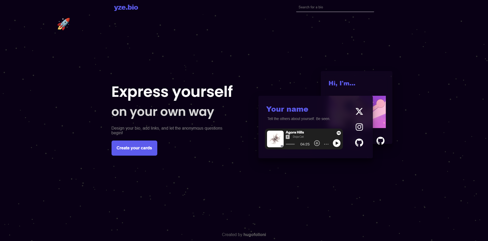
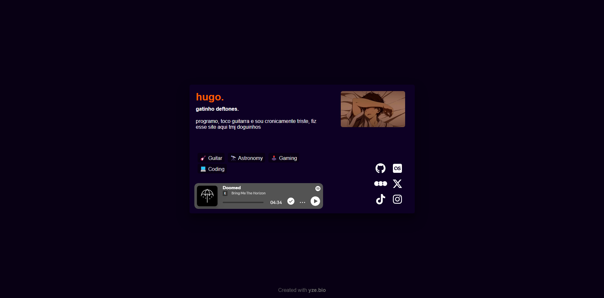

# yze.bio

A web application that enables users to create personalized bio pages, consolidating their online presence into a single, easily shareable link. Users can customize their profiles by adding various social media links, personal information, and other relevant content, providing a centralized hub for their digital identity.

The platform focuses on simplicity and user-friendliness, allowing individuals to set up and manage their bio pages without requiring technical expertise. By offering a clean and intuitive interface, yze.bio helps users effectively present themselves online and connect with their audience.

[Explore the live project](https://yze.bio)  
[Access the source code](https://github.com/hugofolloni/yze-bio)

---

## Table of Contents

1. [Technologies Used](#technologies-used)
2. [User Story](#user-story)
3. [Screenshots](#screenshots)
4. [Getting Started](#getting-started)
5. [Contribution](#contribution)
6. [License](#license)

---

## Technologies Used

This project utilizes the following technologies:

- **Frontend**: JavaScript, React.js
- **Backend**: C#, .NET 8
- **Database**: PostgreSQL

---

## User Story

### Persona:  
As an individual seeking to establish an online presence, I want to create a personalized bio page so that I can effectively share my profile and connect with a broader audience.

### Example Flow:  
1. The user signs up on yze.bio.
2. They create a personalized bio page using the intuitive editor.
3. The user shares their yze.bio link with their audience.

---

## Screenshots


*yze.bio Homepage*


  

*yze.bio Profile*

---

## Getting Started

### Prerequisites

Ensure you have the following installed:

- Node.js
- .NET Core SDK

### Installation

1. Clone the git repository:
    ```bash
    git clone https://github.com/your-username/yze-bio.git
    ```
2. **Front-end**:
    - Change the API connections to localhost.
    - Setup .env infos to real ones.
    ```bash
    cd yze-bio/website
    npm i
    npm start
    ```
3. **Back-end**:
    - Generate a PostgreSQL database and update the information "ConnectionStrings__DefaultConnection" in the `appsettings.json` file inside the `Server` folder. Also, add a key to "ApiSettings__ApiKey".
    - Run the table creation scripts available in the `setup.sql` file inside the `server/api` folder.
    ```bash
    cd yze-bio/Server
    dotnet run --launch-profile https
    ```

## Contribution 
Feel free to contribute to the project! Just fork the repository, implement your improvements, and submit a pull request.

## License 
This project is under the MIT license.